

  

<h1 align="center">Black Fox Vpn Installer</h1>

  <strong>Multi-Location VPN Manager for Windows & Android</strong> 
  WireGuard + 3X-UI automated deployment

  <a href="https://foxnext.net">Website</a> •
  <a href="https://foxnext.net/downloads/Black%20Fox%20Vpn-Installer-Setup.exe">Windows</a> •
  <a href="https://foxnext.net/downloads/BlackFox-VPN-Android-release.apk">Android</a> •
  <a href="https://github.com/balckfoxgroup/blackfox-config-builder">Config Builder</a> •
  <a href="https://t.me/blackFoxVPNN">Telegram</a> •
  <a href="https://github.com/balckfoxgroup">GitHub</a>

---

## What's New

| Platform | App | Status |
|----------|-----|--------|
| Windows | Black Fox Vpn Installer | **Available** — v1.3.0  |
| Android | **BlackFox Vpn Android** | **Now available** — v0.4.13 |
| macOS | Black Fox Vpn | Coming soon |
| Android | [Black Fox Config Builder](https://github.com/balckfoxgroup/blackfox-config-builder) | **Available** — v1.1.3 — [separate repo](https://github.com/balckfoxgroup/blackfox-config-builder) |

> **macOS versions will be released soon. Stay tuned for upcoming updates.**

---

## English

### Black Fox Vpn Installer & BlackFox Vpn Android

**Automatic 3X-UI installation.**

Black Fox is a suite of server management and deployment tools — not a simple VPN client. This software suite is designed for environments where access to the global internet is limited, helping you deploy and manage your own multi-location VPN infrastructure without deep Linux expertise. From Windows or Android, you can automatically install the 3X-UI  panel, WireGuard, and many other features on Linux servers. The solution is optimized for networks with communication restrictions and special routing requirements.

| Resource | Link |
|----------|------|
| Website | [foxnext.net](https://foxnext.net) |
| Download Windows | [Black Fox Vpn-Installer-Setup.exe](https://foxnext.net/downloads/Black%20Fox%20Vpn-Installer-Setup.exe) |
| Download Android | [BlackFox-VPN-Android-release.apk](https://foxnext.net/downloads/BlackFox-VPN-Android-release.apk) |
| Download Config Builder | [GitHub repo](https://github.com/balckfoxgroup/blackfox-config-builder) · [APK](https://foxnext.net/downloads/Black-Fox-Config-Builder.apk) |
| Telegram Channel | [@blackFoxVPNN](https://t.me/blackFoxVPNN) |
| GitHub | [balckfoxgroup](https://github.com/balckfoxgroup) |
| Roadmap (EN) | [docs/ROADMAP.en.md](docs/ROADMAP.en.md) |
| Whitepaper (EN) | [docs/WHITEPAPER.en.md](docs/WHITEPAPER.en.md) |
| Quick Start (PDF) | [docs/Quick-Start-Guide.pdf](docs/Quick-Start-Guide.pdf) |
| Android docs | [Mobile/README.md](Mobile/README.md) |

**Global language support:** Full 10-language support is available across all current app editions and the website (`foxnext.net`): English, Persian (Farsi), Russian, Chinese, German, Uzbek, Turkish, Indonesian, Ukrainian, and Hindi.

**Current version (Windows):** 1.3.0

**BlackFox Vpn Android:** 0.4.13 — [Download APK](https://foxnext.net/downloads/BlackFox-VPN-Android-release.apk)

**Black Fox Config Builder (Android):** See [balckfoxgroup/blackfox-config-builder](https://github.com/balckfoxgroup/blackfox-config-builder) — v1.1.3 

**Coming soon:** macOS desktop app

---

## فارسی

### Black Fox Vpn Installer و BlackFox Vpn Android

**نصب خودکار 3X-UI (سنایی)**

Black Fox مجموعه ابزارهای مدیریت و راه‌اندازی سرور است، نه یک کلاینت VPN ساده. این مجموعه نرم‌افزار برای شرایطی طراحی شده که دسترسی به اینترنت جهانی محدود است و به شما کمک می‌کند بدون نیاز به دانش عمیق لینوکس، زیرساخت VPN چندلوکیشن خود را راه‌اندازی و مدیریت کنید. با آن می‌توانید از ویندوز یا اندروید، پنل 3X-UI (سنایی) و WireGuard و بسیاری امکانات دیگر را به‌صورت خودکار روی سرورهای لینوکس نصب کنید. این راهکار برای شبکه‌هایی با محدودیت‌های ارتباطی و مسیریابی ویژه بهینه شده است.

| منبع | لینک |
|------|------|
| وب‌سایت | [foxnext.net](https://foxnext.net) |
| دانلود ویندوز | [Black Fox Vpn-Installer-Setup.exe](https://foxnext.net/downloads/Black%20Fox%20Vpn-Installer-Setup.exe) |
| دانلود اندروید | [BlackFox-VPN-Android-release.apk](https://foxnext.net/downloads/BlackFox-VPN-Android-release.apk) |
| دانلود Config Builder | [مخزن GitHub](https://github.com/balckfoxgroup/blackfox-config-builder) · [APK](https://foxnext.net/downloads/Black-Fox-Config-Builder.apk) |
| کانال تلگرام | [@blackFoxVPNN](https://t.me/blackFoxVPNN) |
| مخزن گیت‌هاب | [balckfoxgroup/blackfox-vpn-installer](https://github.com/balckfoxgroup/blackfox-vpn-installer) |
| نقشه راه (فارسی) | [docs/ROADMAP.fa.md](docs/ROADMAP.fa.md) |
| وایت‌پیپر (فارسی) | [docs/WHITEPAPER.fa.md](docs/WHITEPAPER.fa.md) |
| راهنمای سریع (PDF) | [docs/Quick-Start-Guide.pdf](docs/Quick-Start-Guide.pdf) |
| مستندات اندروید | [Mobile/README.md](Mobile/README.md) |

**نسخه فعلی (ویندوز):** 1.3.0

**BlackFox Vpn Android:** 0.4.13 — [دانلود APK](https://foxnext.net/downloads/BlackFox-VPN-Android-release.apk)

**Black Fox Config Builder (اندروید):** [balckfoxgroup/blackfox-config-builder](https://github.com/balckfoxgroup/blackfox-config-builder) — نسخه 1.1.3

**به‌زودی:** نسخه macOS

> نسخه‌های macOS به‌زودی منتشر خواهند شد. برای اطلاع از آخرین به‌روزرسانی‌ها، سایت را دنبال کنید.

---

## Screenshots

### Windows — Black Fox Vpn Installer

  

<em>Basic Mode vs Pro Mode</em>

  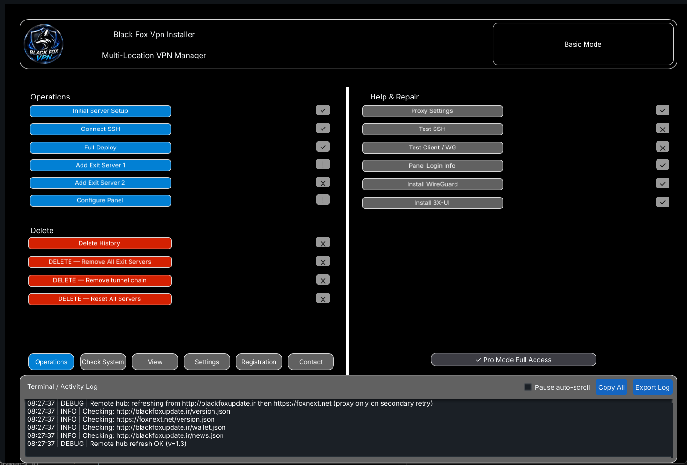
  &nbsp;&nbsp;
  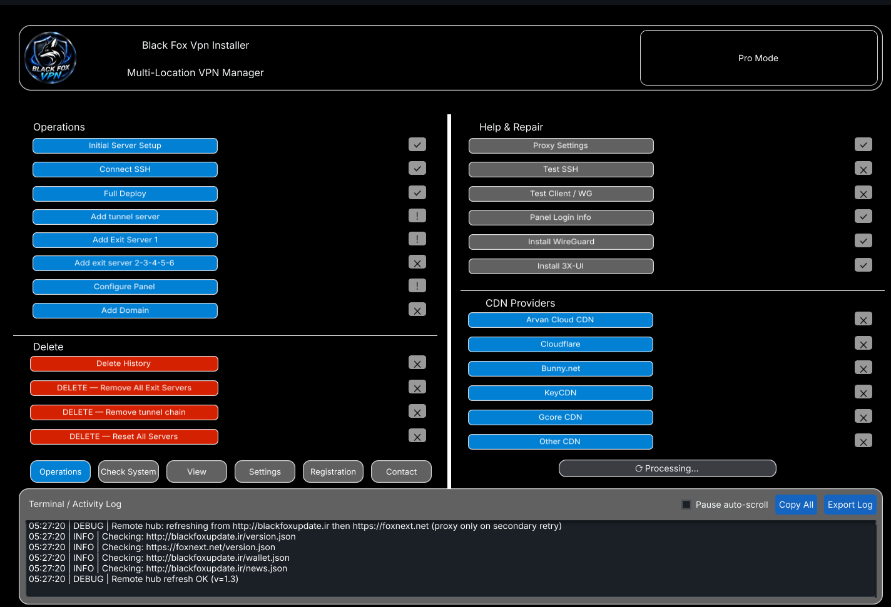

<em>Basic Mode · Pro Mode</em>

---

### Android — BlackFox Vpn Android

<strong>Overview (English & Persian)</strong>

  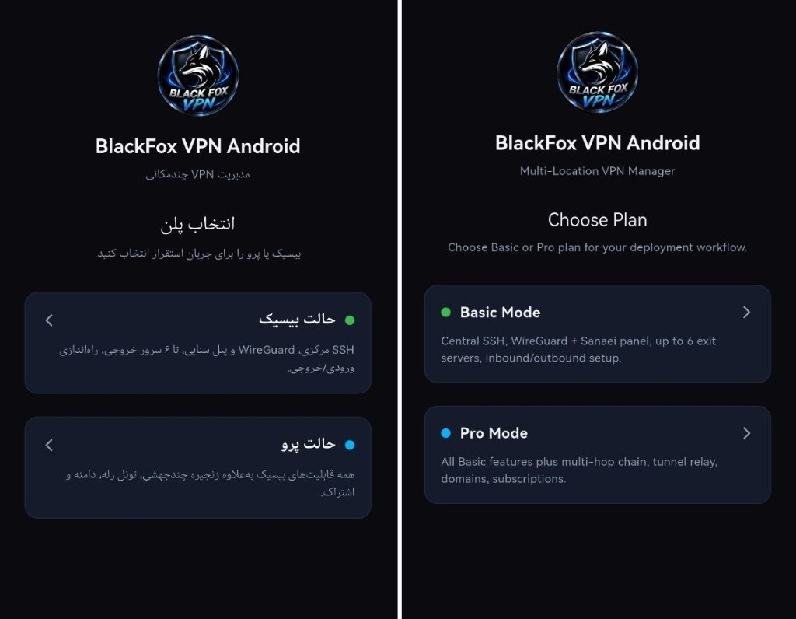
  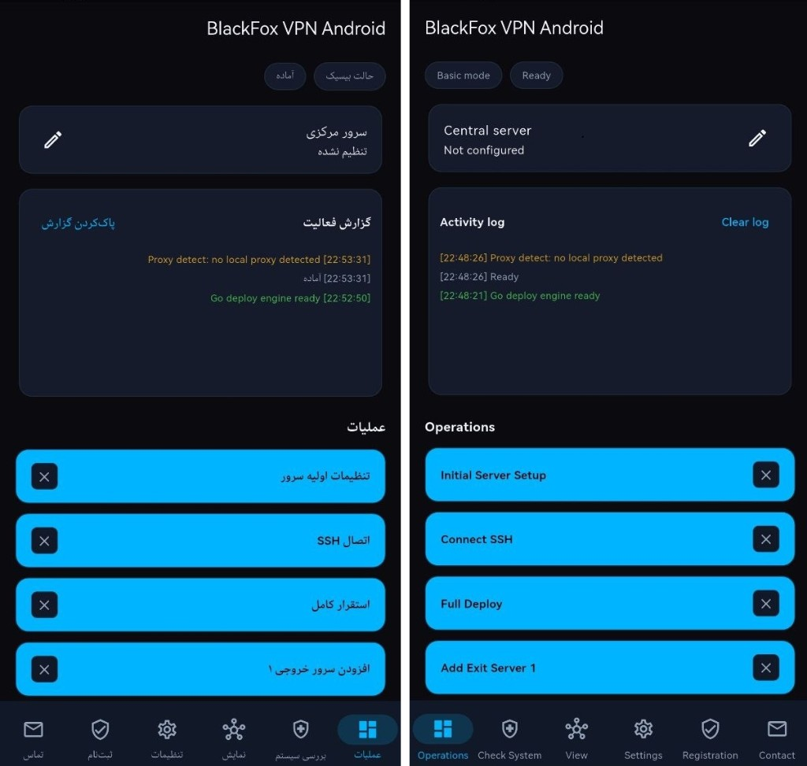
  

<em>Choose Mode · Basic Mode · Pro Mode</em>

<strong>English screens</strong>

  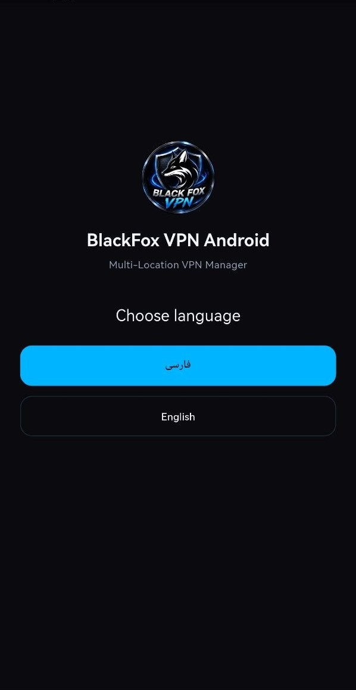
  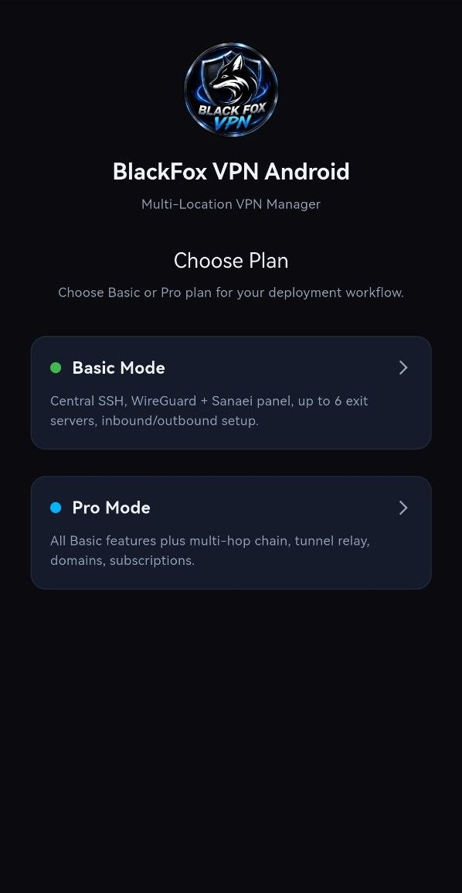
  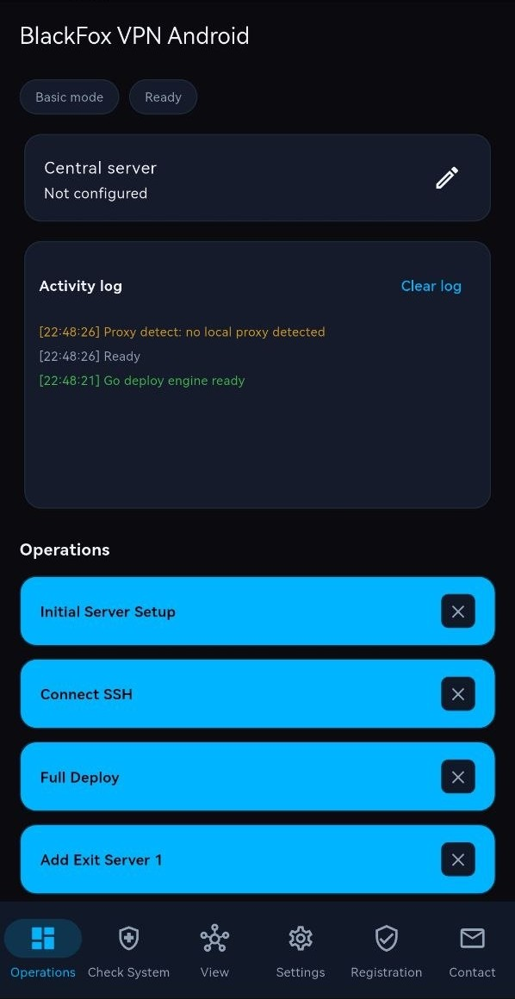
  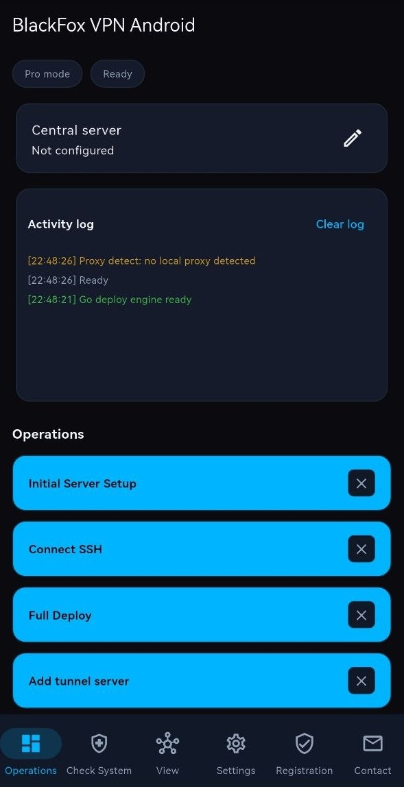

<em>Choose language · Choose mode · Basic Mode · Pro Mode</em>

<strong>Persian screens</strong>

  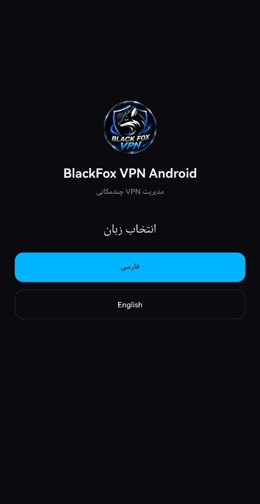
  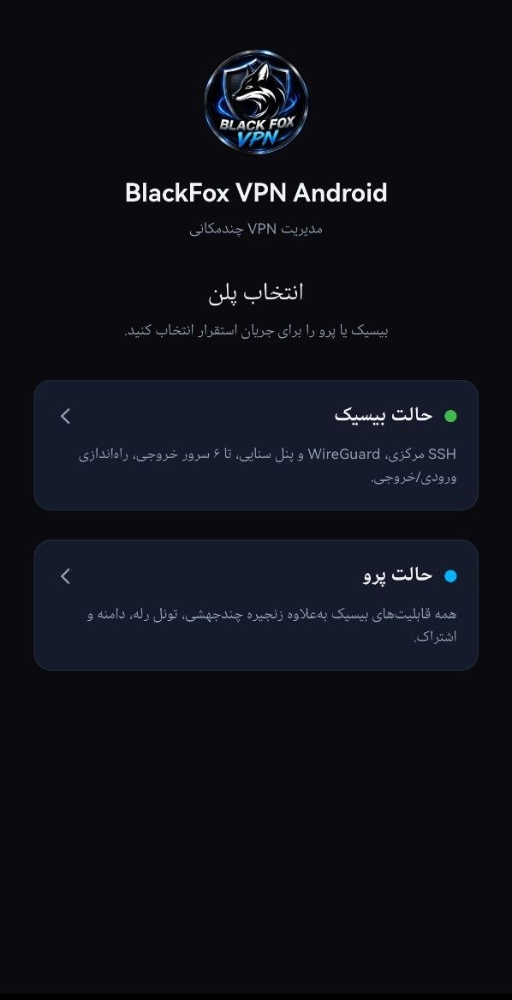
  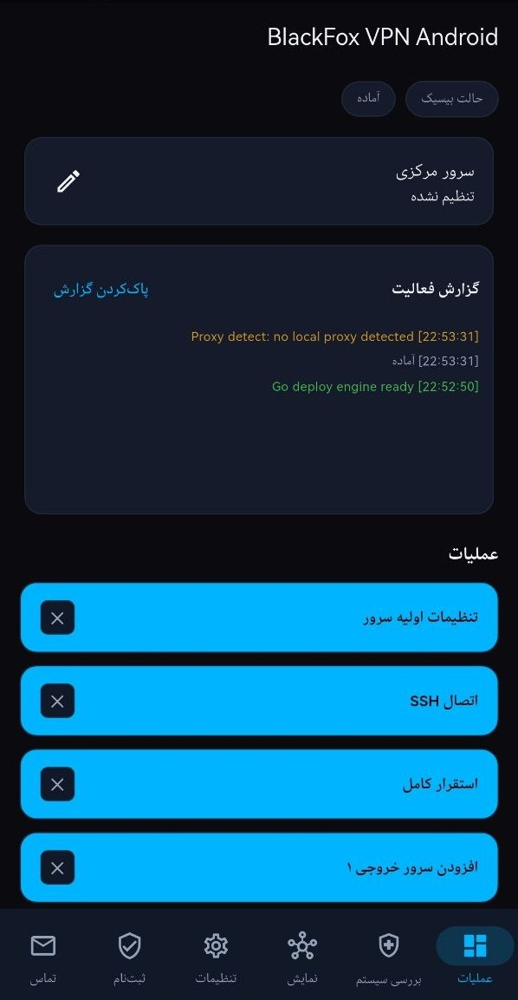
  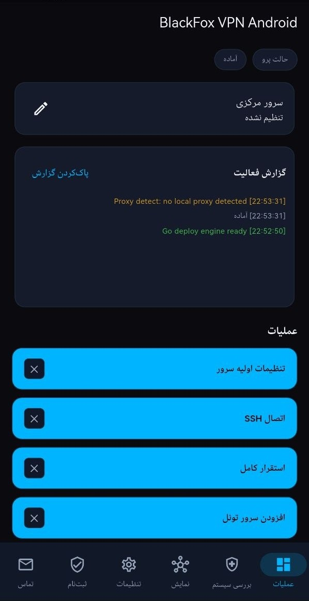

<em>انتخاب زبان · انتخاب حالت · Basic Mode · Pro Mode</em>

---

## Support

- Telegram: [https://t.me/blackFoxVPNN](https://t.me/blackFoxVPNN)
- Website: [https://foxnext.net](https://foxnext.net)
- GitHub: [https://github.com/balckfoxgroup](https://github.com/balckfoxgroup)
- Email: support@foxnext.net

© Black Fox Security Team
