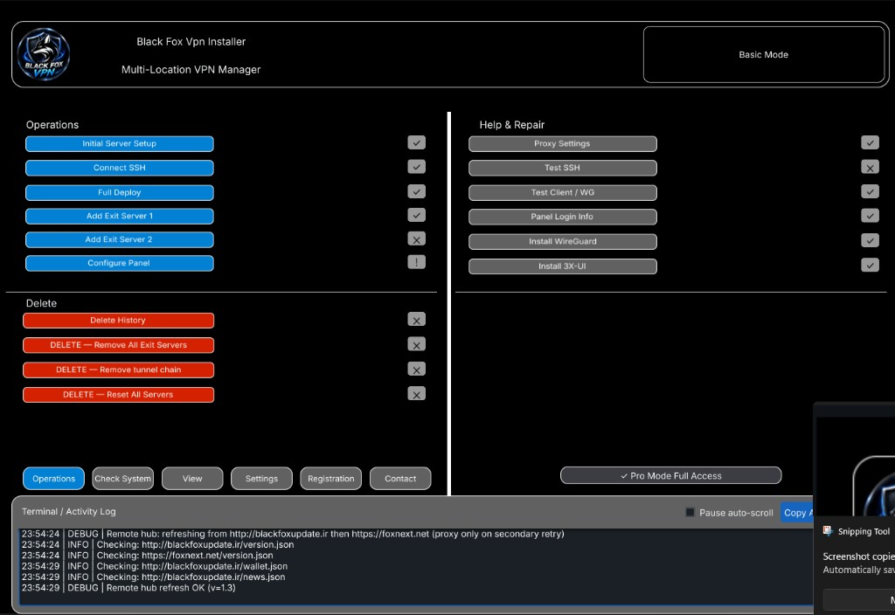
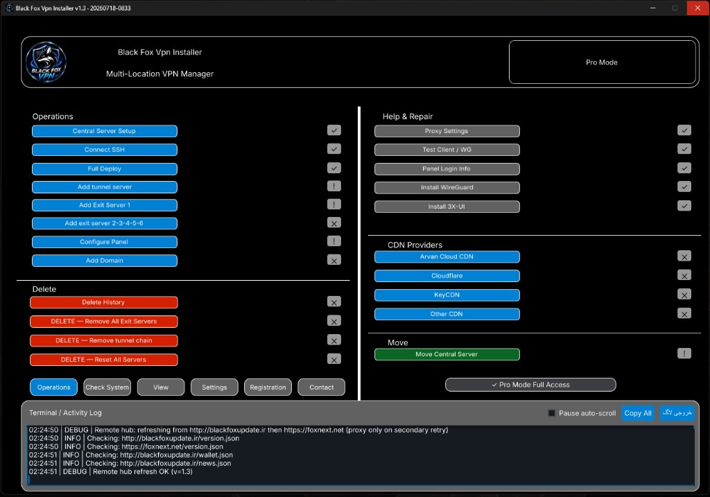

# Roadmap — Black Fox Vpn Installer

**Version:** 1.3.0 | **Build:** 200 | **Updated:** July 2026

[نسخه فارسی](ROADMAP.fa.md)

---

## Vision

Provide the simplest path to deploy and operate multi-location VPN infrastructure on Linux servers — without deep Linux expertise.

Black Fox Group products are **server management and deployment tools**, not a simple VPN client.

  

---

## Status legend

| Label | Meaning |
|-------|---------|
| **Completed** | Shipped and available in the current product |
| **In Progress** | Actively being improved |
| **Planned** | On the roadmap; not a released feature yet |

---

## Completed

| Item | Notes |
|------|--------|
| Windows release — Black Fox Vpn Installer | v1.3.0 (Build 200) — [Download](https://foxnext.net/downloads/Black%20Fox%20Vpn-Installer-Setup.exe) |
| Android release — BlackFox Vpn Android | v0.4.13 (Build 20) — [Download APK](https://foxnext.net/downloads/BlackFox-VPN-Android-release.apk) |
| Black Fox Config Builder (Android) | v1.1.3 (Build 7) — [APK](https://foxnext.net/downloads/Black-Fox-Config-Builder.apk) · [Repo](https://github.com/balckfoxgroup/blackfox-config-builder) |
| 10-language support (apps + website) | English, Persian (Farsi), Russian, Chinese, German, Uzbek, Turkish, Indonesian, Ukrainian, Hindi |
| Basic Mode | Simplified central + exit workflow |
| Pro Mode | Multi-server infrastructure operations |
| Central Server management | Setup, SSH connect, Full Deploy, panel install |
| Tunnel Server management (Pro) | Multi-hop relay chain |
| Exit Server management | Basic: exits 1–2 · Pro: exits 1–6 |
| WireGuard tunnel support | Primary tunnel path |
| GRE tunnel fallback | Used when WireGuard path fails |
| Domain & subdomain management (Pro) | DNS providers: Cloudflare, ArvanCloud |
| CDN automation (Pro, Windows) | ArvanCloud, Cloudflare, KeyCDN, Other CDN |
| Automated 3X-UI (Sanaei) install & management | Embed package + panel configuration |
| Move Central Server (Pro) | Migrate central infrastructure with automated panel client transfer |
| Local backup during Move Central | Snapshot/backup created as part of migration |
| Smart SSH proxy | For restricted network environments |
| Dual update hosts | `foxnext.net` + `blackfoxupdate.ir` |
| USDT license registration | Basic / Pro tiers (current site pricing) |
| Official website | [foxnext.net](https://foxnext.net) |
| Privacy Policy page | [English](https://foxnext.net/en/privacy.html) · [Persian](https://foxnext.net/fa/privacy.html) |

---

## In Progress

| Item | Notes |
|------|--------|
| Basic Mode UX hardening | Clearer status, recovery, and guided flows |
| Pro Mode UX hardening | Operations clarity, safer delete/reset paths |
| Website & localization polish | Keep all 10 languages aligned with product builds |
| Android feature parity with Windows Pro | CDN UI and some advanced Windows ops still Windows-first |
| Host delivery reliability | More stable uploads/updates across primary/secondary hosts |

---

## Planned

| Item | Notes |
|------|--------|
| macOS desktop app | Coming soon — see `README-MAC.md` |
| Google Play listing for BlackFox Vpn Android | **Coming Soon** (APK already available from the official website) |
| Mid-workflow resume from checkpoint | Safer continue-from-middle UI (recovery exists today; full resume is planned) |
| Standalone infrastructure Backup & Restore | Broader backup/restore beyond Move Central snapshots |
| Longer tunnel chains | Extended multi-hop scalability |
| Traffic / uptime reporting | Operational visibility |
| Remote management API | Programmatic control |
| Telegram bot integration | Future operations helper |

---

## Platform matrix

| Platform | Product | Status |
|----------|---------|--------|
| Windows | Black Fox Vpn Installer | **Available** — v1.3.0 (Build 200) |
| Android | BlackFox Vpn Android | **Available** — v0.4.13 (Build 20) |
| Android | Black Fox Config Builder | **Available** — v1.1.3 (Build 7) |
| Android | Google Play distribution | **Coming Soon** |
| macOS | Black Fox Vpn | **Coming Soon** |

---

## Basic vs Pro (current)

  
  &nbsp;
  

| Capability | Basic | Pro |
|------------|-------|-----|
| Central Server | Yes | Yes |
| Exit Servers | 1–2 | 1–6 |
| Tunnel Servers | No | Yes |
| Domain / DNS | No | Yes |
| CDN providers | No | Yes (Windows) |
| Move Central Server | No | Yes |
| WireGuard + GRE fallback | Yes | Yes |
| Free central countries (license rules) | Iran, China, Russia | Broader Pro access |

---

## Near-term focus

1. Keep Windows + Android releases stable and synchronized  
2. Improve Pro migration/backup workflows  
3. Prepare Google Play publication for Android  
4. Advance macOS desktop packaging  

---

## Links

- Website: [foxnext.net](https://foxnext.net)
- Privacy Policy: [foxnext.net/en/privacy.html](https://foxnext.net/en/privacy.html)
- Windows: [Setup.exe](https://foxnext.net/downloads/Black%20Fox%20Vpn-Installer-Setup.exe)
- Android: [APK](https://foxnext.net/downloads/BlackFox-VPN-Android-release.apk)
- Config Builder: [GitHub](https://github.com/balckfoxgroup/blackfox-config-builder)
- Telegram: [@blackFoxVPNN](https://t.me/blackFoxVPNN)
- Repository: [balckfoxgroup/blackfox-vpn-installer](https://github.com/balckfoxgroup/blackfox-vpn-installer)

---

## Support the Project

If BlackFox VPN Installer helps you, please consider starring the repository.

- Star the Repository
- Report Bugs
- Suggest Features
- Share the Project
- Support the Development

© Black Fox Security Team
