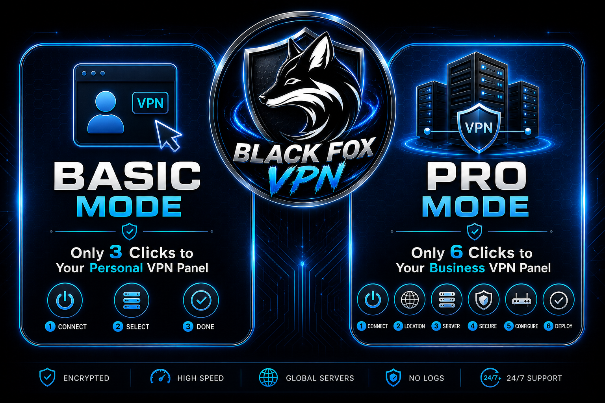
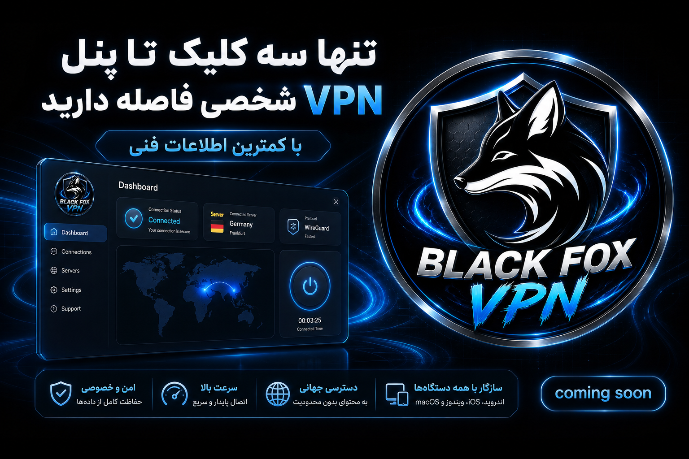
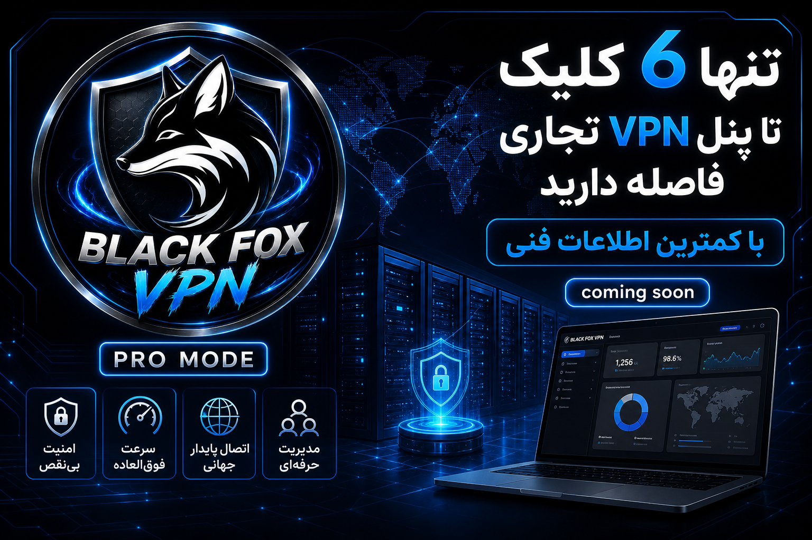

  

# Roadmap — Black Fox Vpn Installer

**Version:** 1.3.0 | **Build:** 194 | **Date:** 2026

[نسخه فارسی](ROADMAP.fa.md)

---

## Vision

Deliver the simplest way to deploy multi-location commercial and personal VPN infrastructure on Linux servers — without deep Linux expertise.

  

---

## Current Status — v1.3.0

### Completed

| Area | Status |
|------|--------|
| WireGuard + 3X-UI installation | ✅ |
| Basic Mode (3 clicks) | ✅ |
| Pro Mode (6 clicks) | ✅ |
| Central + Exit servers 1–6 | ✅ |
| Multi-hop tunnel servers (Pro) | ✅ |
| GRE fallback | ✅ |
| Smart SSH proxy | ✅ |
| 10 languages | ✅ |
| Updates via foxnext.net / blackfoxupdate.ir | ✅ |
| CDN: Arvan, Cloudflare, Bunny, KeyCDN, Gcore | ✅ |
| USDT license registration | ✅ |

---

## Phase 1 — Stability (Q3 2026)

| Priority | Item |
|----------|------|
| High | Improve FTP stability and secondary host uploads |
| High | Automated deploy tests for Basic and Pro |
| Medium | Better terminal error messages |
| Medium | Multilingual docs and Quick Start guide |

---

## Phase 2 — User Experience (Q4 2026)

| Priority | Item |
|----------|------|
| High | Unified first-run setup wizard |
| Medium | Real-time status dashboard |
| Medium | WireGuard config preview in UI |
| Low | Customizable dark/light theme |

---

## Phase 3 — Scalability (2027)

| Priority | Item |
|----------|------|
| High | Support for longer tunnel chains |
| Medium | Automatic config backup and restore |
| Medium | Traffic and uptime reporting |
| Low | Remote management API |

---

## Phase 4 — Platform Expansion (2027+)

- macOS version (under review — see `README-MAC.md`)
- Web management panel for multiple servers
- Telegram bot integration (`@BlackFoxVpn_bot`)

---

## Basic vs Pro

  
  

| Feature | Basic | Pro |
|---------|-------|-----|
| Clicks to panel | 3 | 6 |
| Exit servers | 1 + 2 | 1–6 |
| Tunnel servers | ❌ | ✅ |
| Domain / DNS | ❌ | ✅ |
| CDN | ❌ | ✅ |
| Full license | 30 USDT | 50 USDT |

---

## Links

- Website: [foxnext.net](https://foxnext.net)
- Download: [Setup.exe](https://foxnext.net/downloads/Black%20Fox%20Vpn-Installer-Setup.exe)
- Telegram: [@blackFoxVPNN](https://t.me/blackFoxVPNN)

---

© Black Fox Security Team
