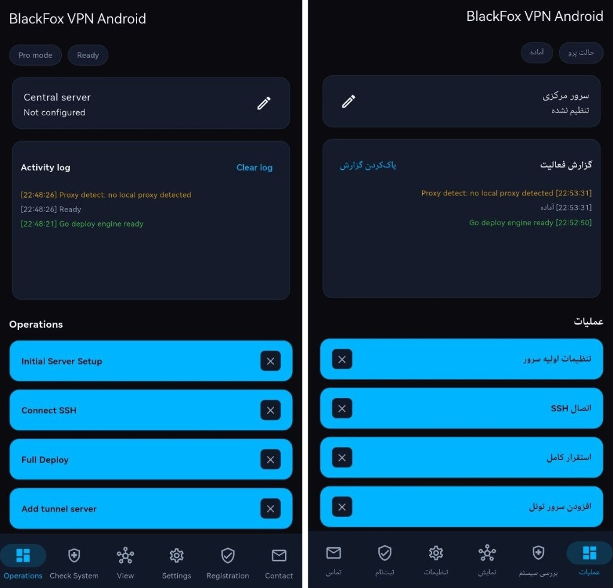

# Whitepaper — Black Fox Vpn Installer

**Version:** 1.3.0 | **Build:** 200 | **Updated:** July 2026

[نسخه فارسی](WHITEPAPER.fa.md)

---

## 1. Executive Summary

**Black Fox Vpn Installer** is not a simple VPN client.

It is a **suite of server management and deployment tools** for:

- Server Deployment Automation  
- Multi-Server Infrastructure Management  
- VPN Infrastructure Configuration  
- Central Server Management  
- Tunnel Management  
- Exit Server Management  
- Backup and Restore (as part of Central Server migration)  

The product family currently ships on **Windows** and **Android**, with a dedicated **Config Builder** for Android. A **macOS** edition is planned. Google Play distribution for Android is **Coming Soon**; the Android APK is already available from the official website.

Official site: [https://foxnext.net](https://foxnext.net)

---

## 2. Problem Statement

Building multi-location VPN infrastructure usually requires:

- Manual WireGuard installation and routing  
- 3X-UI panel setup and inbound management  
- SSH, firewall, and credential handling  
- Connecting foreign exit servers to a central hub  
- Optional CDN / DNS automation  

For operators without deep Linux expertise, this process is slow, fragile, and hard to repeat safely.

---

## 3. Solution

Black Fox Group applications reduce complex multi-server work to guided graphical workflows.

From a Windows PC or Android device, operators can install and manage:

- 3X-UI (Sanaei) panel  
- WireGuard  
- Exit and tunnel topology  
- Domain / CDN automation (Pro)  
- Central Server migration with client continuity  

<p align="center">
  
</p>

---

## 4. Architecture

High-level chain:

```text
Central Server
      ↓
Tunnel Server (Pro, optional multi-hop)
      ↓
Exit Server
      ↓
Client Infrastructure (panel clients / end users)
```

### 4.1 Basic Mode

Designed for operators who need a simpler and faster path:

```text
[Operator App] → SSH → [Central: WireGuard + 3X-UI]
                              │
                    ┌─────────┴─────────┐
                    ▼                   ▼
              [Exit 1]            [Exit 2]
```

### 4.2 Pro Mode

Designed for advanced multi-server infrastructure:

```text
[Central] → [Tunnel…] → [Exit 1..6]
```

- Tunnel servers act as relays  
- Exit servers provide egress  
- **WireGuard** is the primary path  
- **GRE fallback** can be used when WireGuard fails  

<p align="center">
  
  &nbsp;
  
</p>

---

## 5. Product Modes

### Basic Mode

For users who need a simpler, faster structure:

- Central Server setup  
- Full Deploy  
- Exit servers (limited slots)  
- Configure Panel  
- Core install helpers (WireGuard / 3X-UI)  

### Pro Mode

For advanced multi-server operations:

- Central Server  
- Tunnel Server  
- Exit Server (up to 6)  
- WireGuard + GRE  
- Domain / DNS management  
- CDN providers (Windows Pro)  
- Move Central Server  
- Migration backup + automated panel client transfer  

---

## 6. Platform Releases

| Platform | Product | Status |
|----------|---------|--------|
| Windows | Black Fox Vpn Installer v1.3.0 (Build 200) | Available |
| Android | BlackFox Vpn Android v0.4.13 (Build 20) | Available — download from [foxnext.net](https://foxnext.net/downloads/BlackFox-VPN-Android-release.apk) |
| Android | Google Play listing | **Coming Soon** |
| Android | Black Fox Config Builder v1.1.3 (Build 7) | Available |
| macOS | Black Fox Vpn | Coming Soon |

<p align="center">
  
</p>

<p align="center"><em>Android — BlackFox Vpn Android is released and available from the official website. Google Play publication is Coming Soon.</em></p>

---

## 7. Supported Languages

BlackFox Group applications are designed for a global audience and support **10 major living languages**:

English, Persian (Farsi), Russian, Chinese, German, Uzbek, Turkish, Indonesian, Ukrainian, and Hindi.

This coverage applies across current app editions and the website (`foxnext.net`).

---

## 8. Core Technologies

| Layer | Technology |
|-------|------------|
| Windows client | Go + Fyne |
| Android client | Flutter |
| Tunnel | WireGuard (primary), GRE (fallback) |
| Panel | 3X-UI (Sanaei) |
| Egress | microsocks on exit servers |
| Transport | SSH (password or key), proxy-aware |
| Updates | `foxnext.net` + `blackfoxupdate.ir` |
| Locales | 10 shared languages |

---

## 9. Domain, CDN, and Migration

### Domain / DNS (Pro)

Supported DNS automation providers include **Cloudflare** and **ArvanCloud**.

### CDN (Pro, Windows)

Supported CDN providers in the current Windows Pro UI:

- ArvanCloud  
- Cloudflare  
- KeyCDN  
- Other CDN  

### Move Central Server (Pro)

Pro Mode includes **Move Central Server** to relocate the central role while preserving operational continuity:

- Infrastructure snapshot / backup during move  
- Automated transfer of Central Server panel clients  
- Designed to keep client access continuous through migration  

Broader standalone Backup & Restore tooling remains on the roadmap beyond Move Central.

---

## 10. Security Model

- SSH authentication via password or private key  
- Host key verification to reduce MITM risk  
- Machine-bound licensing  
- Sensitive credentials are not written to application logs  
- Operations run against the operator’s own servers  

---

## 11. Privacy Policy

Black Fox Group publishes a dedicated Privacy Policy for the product family.

Users can review how data handling is described on the official pages:

- English: [https://foxnext.net/en/privacy.html](https://foxnext.net/en/privacy.html)  
- Persian: [https://foxnext.net/fa/privacy.html](https://foxnext.net/fa/privacy.html)  

The Privacy Policy is maintained separately from this whitepaper and should be treated as the authoritative privacy statement.

---

## 12. Licensing

License tiers are offered for Basic and Pro access and verified through USDT payment flows / license codes.

Current public website pricing should be checked on [foxnext.net](https://foxnext.net) (Basic and Pro USDT tiers).

---

## 13. Updates

Applications refresh metadata from:

1. `http://blackfoxupdate.ir` (primary where available)  
2. `https://foxnext.net` (secondary / public host)  

Typical files:

- `/version.json`  
- `/news.json`  
- `/wallet.json`  

---

## 14. Target Audience

- Operators who need a private multi-location panel  
- Teams running commercial VPN infrastructure  
- Administrators who prefer guided automation over manual Linux work  

---

## 15. Roadmap Reference

See [ROADMAP.en.md](ROADMAP.en.md) for Completed / In Progress / Planned items, including macOS and Google Play (Coming Soon).

---

## 16. Links

| Resource | URL |
|----------|-----|
| Website | [foxnext.net](https://foxnext.net) |
| Privacy Policy | [foxnext.net/en/privacy.html](https://foxnext.net/en/privacy.html) |
| Windows download | [Setup.exe](https://foxnext.net/downloads/Black%20Fox%20Vpn-Installer-Setup.exe) |
| Android download | [APK](https://foxnext.net/downloads/BlackFox-VPN-Android-release.apk) |
| Config Builder | [GitHub](https://github.com/balckfoxgroup/blackfox-config-builder) |
| Telegram | [@blackFoxVPNN](https://t.me/blackFoxVPNN) |
| GitHub | [balckfoxgroup/blackfox-vpn-installer](https://github.com/balckfoxgroup/blackfox-vpn-installer) |
| Email | support@foxnext.net |

---

## Support the Project

If BlackFox VPN Installer is useful to you, please support Black Fox Group development by starring the repository.

- Star the Repository  
- Report Bugs  
- Suggest Features  
- Share the Project  
- Support the Development  

© Black Fox Security Team — 2026
